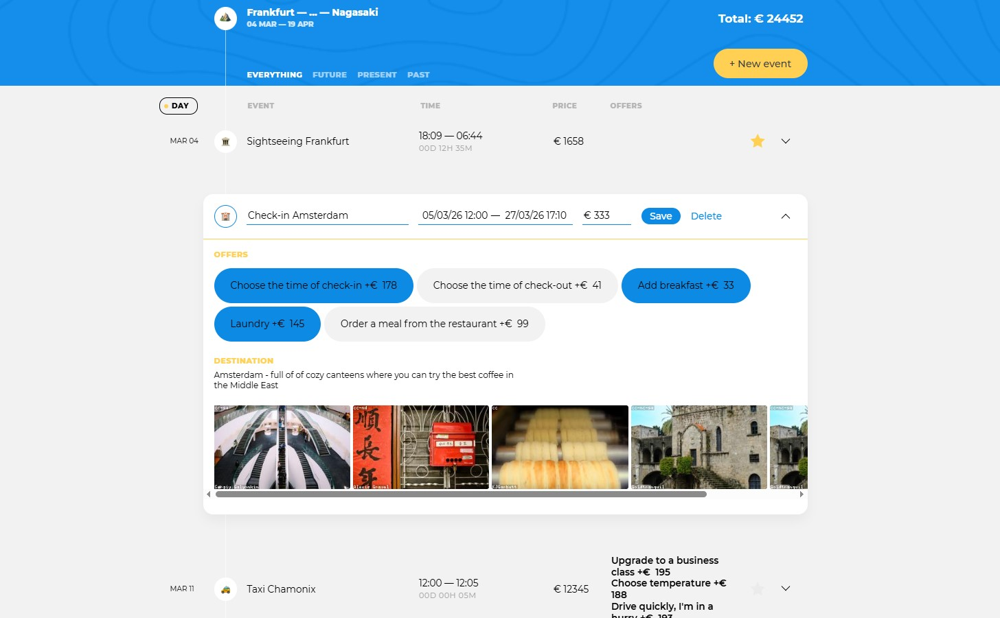

# 📋 Voyager Dashboard — Travel Management System

<p align="center">
  
</p>

<p align="center">
  <strong>A high-performance Single Page Application (SPA) designed for planning and managing complex travel itineraries with real-time data synchronization.</strong>
</p>

---

## 📖 Overview
Voyager Dashboard is a sophisticated travel planning platform built with **Vanilla TypeScript** using the **MVP (Model-View-Presenter)** architectural pattern. The project focuses on handling complex state transitions, modular UI components, and seamless integration with a remote API.

## 🛠 Tech Stack
| Layer | Technologies |
| :--- | :--- |
| **Core** | TypeScript (Strict Mode) — Object-Oriented Design |
| **Architecture** | MVP (Model-View-Presenter) Pattern |
| **UI Engine** | Abstract View Components, Flatpickr (Date handling) |
| **Networking** | API Service with Bearer Token Auth |
| **Build Tool** | Webpack 5, Babel |
| **Utilities** | Day.js, He (Encoding), Cross-env |

---

## 🎯 Key Features & Engineering Challenges
* 🏗️ **Architectural Excellence**: Implemented a strict **MVP pattern** to decouple business logic (Models) from rendering (Views), coordinated by Presenters.
* 🧩 **Component-Based UI**: Developed a custom framework of reusable components (`AbstractView`, `AbstractStatefulView`) to handle complex DOM manipulations and state updates.
* ⏱️ **Advanced Form Handling**: Integrated **Flatpickr** for precise time selection and implemented comprehensive validation for travel destination data.
* 🔄 **Reactive Updates**: Utilized an **Observable** pattern to ensure the UI stays in sync with data changes without full page reloads.
* 📡 **Live Backend Integration**: Communicates with the [bvtrots-test-server](https://bvtrots-test-server.onrender.com) hosted on Render.

---

## 📂 Project Structure
```text
voyager-dashboard/
├── src/
│   ├── framework/      # Base classes (View, StatefulView, Observable)
│   ├── model/          # Data layer (Points, Destinations, Offers)
│   ├── presenter/      # Business logic & glue code
│   ├── view/           # UI components (Filters, Sort, Form, List)
│   ├── templates/      # HTML structure definitions
│   ├── utils/          # Formatting, time, and common helpers
│   ├── types/          # TypeScript interfaces & enums
│   └── main.ts         # Application entry point
├── public/             # Static assets
├── webpack.config.js   # Build configuration
└── package.json        # Scripts & dependencies
```

## ⚙️ Installation & Setup
1. Clone the repository

        git clone https://github.com/bvtrots/voyager-dashboard.git
        cd voyager-dashboard


2. Install dependencies

        npm install


3. Run in development mode

        npm run start

   [⚠️!IMPORTANT]\
   Note: The application uses a free Render instance for the backend. Free instances spin down after inactivity. On the first launch, it may take 30–60 seconds for the server to "wake up." If data doesn't load immediately, please visit the backend link to trigger the server wake-up.


4. Build for production

        npm run build

---


## 📜 Commit Convention
To maintain a clean and readable history, this project follows a semantic commit convention with emojis:

| Tag | Emoji | Meaning |
| :--- | :--- | :--- |
| **feat** | ✨ | New feature or functionality |
| **fix** | 💊 | Bug fixes and code repairs |
| **refactor** | ♻️ | Code restructuring without changing functionality |
| **style** | 🎨 | UI/UX, CSS, and layout improvements |
| **build** | ⚙️ | Build system configuration or dependencies |
| **chore** | 🔧 | Maintenance, config tweaks, or tool updates |
| **docs** | 📝 | Documentation and comments |

---

📝 Engineering Commentary
This project serves as a deep dive into Vanilla TypeScript and the MVP pattern. The architecture is built for strict type safety and high performance, demonstrating how complex business logic (like travel scheduling and stateful form validation) can be implemented with clean, modular, and extensible code.


<p align="center">
Developed with ❤️ by <strong><a href="https://github.com/bvtrots">bvtrots</a></strong>
</p>